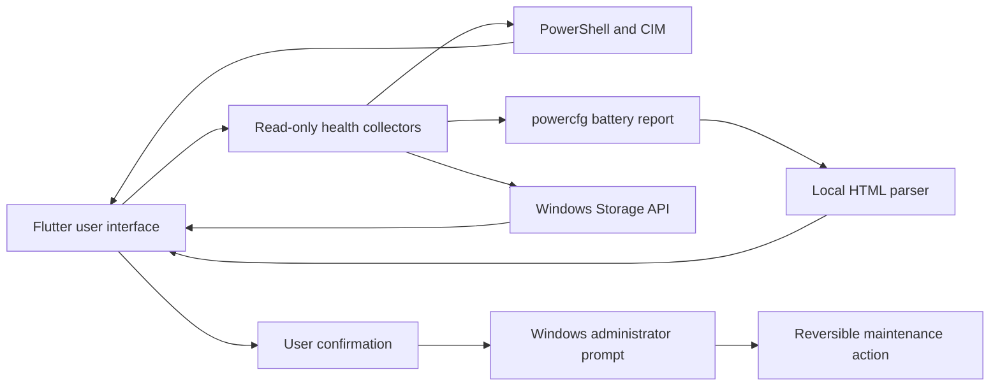
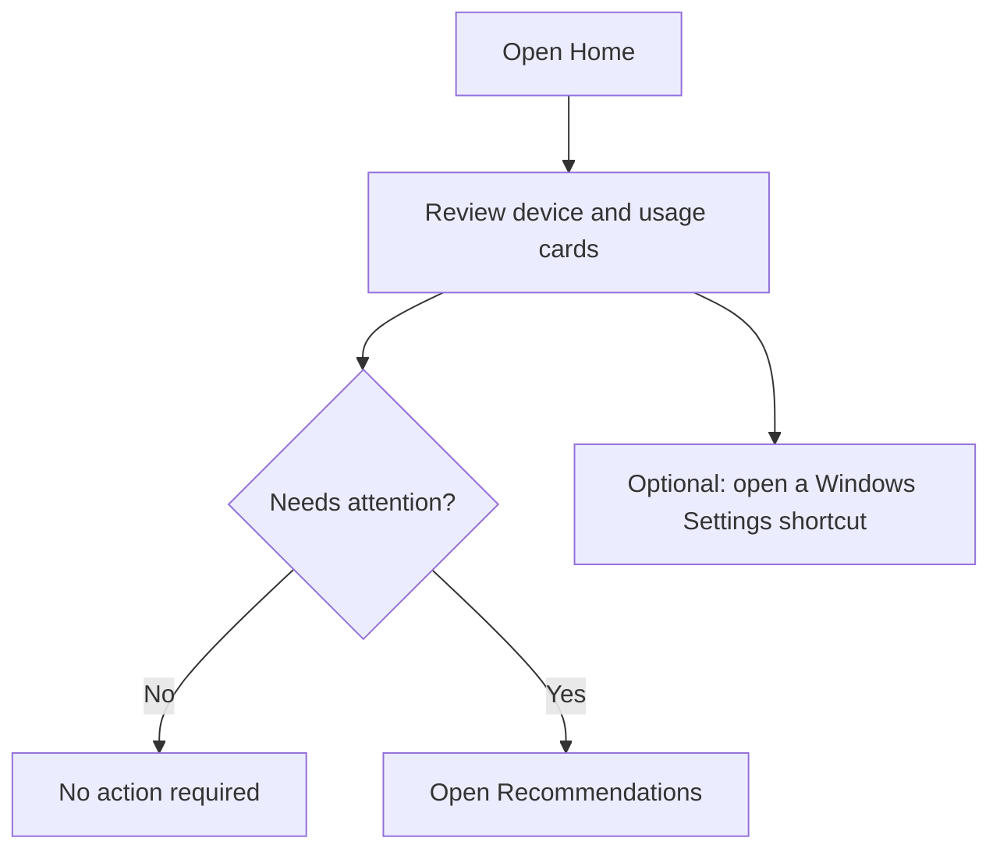
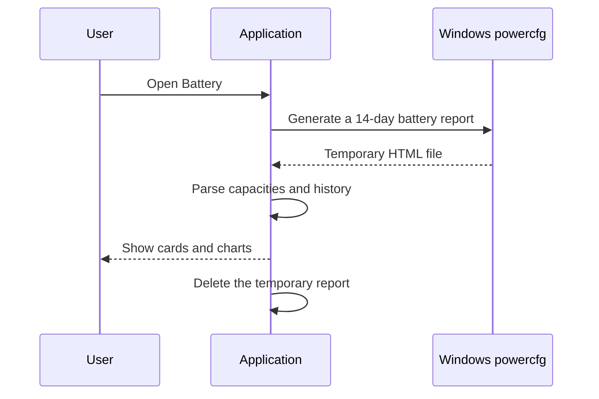

# Ramizom System Health Toolkit

> [!IMPORTANT]
> **This is an AI-generated project.** Its source code and documentation were
> primarily generated and iteratively reviewed with OpenAI Codex under human
> direction. AI-generated code can contain mistakes. Review, test, and sign your
> own build before distributing it or using it on an important computer.

Ramizom System Health Toolkit is a bilingual Flutter desktop application for
Windows. It presents system, battery, storage, privacy, and maintenance
information in language intended for everyday users.

| Product detail | Value |
| --- | --- |
| Product | Ramizom System Health Toolkit |
| Version | 5.0.0.0 |
| Platform | Windows 10 and Windows 11 |
| Developer | Professor Creeper |
| Development period | June 21, 2026 to July 25, 2026 |
| Website | [Ramizom.com](https://ramizom.com) |
| Privacy policy | [Ramizom Privacy Policy](https://ramizom.com/privacy) |

## What's the goal of this project?

The goal is to place the Windows health information and safe maintenance actions
that ordinary users need most in one understandable application.

## What problem is this project going to solve?

Windows exposes useful information across Task Manager, Settings, PowerShell,
Control Panel, battery reports, and storage tools. Finding the right page,
interpreting technical fields, and knowing which actions are reversible can be
difficult. This application gathers that information, explains unavailable
values honestly, and puts confirmation in front of system-changing actions.

## Why did I develop it?

I developed it to make routine Windows checks less fragmented and less
intimidating. The project also explores how an AI-assisted development workflow
can produce a practical native desktop utility while keeping the human in
control of product decisions, safety review, and release approval.

## Who is the target user?

The primary audience is everyday Windows laptop and desktop users. No command
line knowledge is required. Technicians may also use it as a quick first-look
dashboard, but it is not intended to replace vendor diagnostics or professional
data-recovery tools.

## What are its use cases?

- Check CPU, memory, graphics, and system-drive activity at a glance.
- Review battery design capacity, full-charge capacity, health, cycle count,
  recent discharge history, and long-term capacity history.
- Inspect physical-drive health, temperature, lifetime reads and writes, wear,
  power-on time, and available reliability counters.
- Apply or restore microphone, camera, and screen-capture privacy protections.
- Open the correct Windows Settings page without searching through menus.
- Pause or resume Windows Update using a clearly confirmed maintenance action.
- Flush the DNS cache and reset Winsock when network connectivity is damaged.
- Refresh desktop and taskbar icon caches without deleting personal files.
- Receive simple recommendations based on the current system state.

## How it works



Health collection is local. The application does not include analytics,
telemetry, cloud accounts, embedded API keys, or a remote service. It opens only
the product website or privacy-policy page when the user explicitly selects
those links.

The project uses documented Windows interfaces and bundled system tools:

- PowerShell and CIM for system and storage information.
- `powercfg /batteryreport` for the Windows battery report.
- Windows Storage IOCTL queries for read-only NVMe health data.
- `ms-settings:` links for Windows Settings pages.
- Windows registry policy values for confirmed, reversible privacy and update
  controls.
- `ipconfig`, `netsh`, and `ie4uinit` for focused maintenance actions.

## Functions and tutorial with illustrations

### 1. Navigate the application

On a wide window, pages appear in a rail on the left. On a portrait or narrow
window, the main destinations move to the bottom and remaining pages appear
under **Other**.

```text
Wide window                              Narrow window
+-----------+-----------------------+    +----------------------+
| Home      | Page content          |    | Page content         |
| Privacy   |                       |    |                      |
| Battery   |                       |    +----------------------+
| Disk      |                       |    | Home Privacy Battery |
| Recommend |                       |    |        Other         |
| Settings  |                       |    +----------------------+
+-----------+-----------------------+
```

### 2. Read the Home dashboard

Open **Home** to see the current processor, memory, graphics, and system-drive
summary. Use a quick-jump chip to open the related Windows Settings page.
Unavailable measurements remain marked as unavailable instead of being
estimated.



### 3. Review battery information

1. Open **Battery**.
2. Wait for Windows to generate its local battery report.
3. Review design capacity, full-charge capacity, health, cycle count, and the
   charge level recorded in the report.
4. Read the recent battery-use graph and capacity-history graph.
5. Select **Regenerate** when you need a fresh report.



Battery figures come from Windows and the battery firmware. A missing cycle
count or history means the device did not provide it; the application does not
invent a replacement value.

### 4. Inspect disk health

1. Open **Disk Health**.
2. Select a physical drive.
3. Review the health assessment and the metrics that its firmware and driver
   expose.
4. Select **Refresh** after changing or reconnecting a drive.

```text
+------------------------------------------------------+
| Drive model                         Health: 97%       |
+------------------------------------------------------+
| Lifetime read     | Lifetime written | Temperature   |
| Power-on time     | Life used        | Media errors  |
| Power cycles      | Unsafe shutdowns | Bus / sectors |
+------------------------------------------------------+
```

Metric availability varies by drive type, enclosure, firmware, and driver.
Missing values are shown as unavailable. All native disk queries in this
project are read-only.

### 5. Use privacy protection

Open **Privacy & Security**, then enable or disable microphone, camera, or
screen-capture protection. Confirm the Windows administrator prompt when a
machine policy must change.


These controls affect Windows permission and capture policies. They cannot stop
external recording hardware or every privileged driver-level capture tool.
Organization-managed policies may override them.

### 6. Use recommendations and maintenance tools

Open **Recommendations** to review simple actions based on the current system.
Every maintenance action displays a confirmation before it changes Windows.

| Tool | What it changes | What to expect |
| --- | --- | --- |
| Pause updates | Windows Update pause values | Pauses feature and quality updates until September 5, 2042 |
| Resume updates | Restores backed-up update values | Returns update control to its previous state when possible |
| Repair network | DNS cache and Winsock catalog | A Windows restart may be needed |
| Repair icons | Windows icon cache | Desktop and taskbar icons refresh |

Do not use **Pause updates** on a computer whose security policy requires
automatic patching. Organization policy can prevent these controls from taking
effect.

### 7. Change language and appearance

Open **Settings** to choose light, dark, or system theme; select an accent color;
change the dashboard refresh interval; and select a language.

The default language follows Windows:

- Simplified Chinese system locales use Simplified Chinese.
- Traditional Chinese and all other locales use English.
- The manual language setting overrides automatic selection.

## Safety and privacy

- Health collection is read-only and uses local Windows data.
- System-changing actions require an explicit click and confirmation.
- Actions that need elevated rights trigger the standard Windows administrator
  prompt.
- Privacy and update features save previous values before overwriting them and
  provide a restore action.
- The battery report is created in a unique temporary directory, parsed locally,
  and deleted afterward.
- The application does not erase disks, format volumes, alter firmware, change
  voltages, overclock hardware, or run destructive storage commands.
- No secret, credential, personal path, private endpoint, or signing key is
  intentionally stored in this repository.

No software can guarantee safety on every Windows installation. Back up
important data, read each confirmation, and test releases on a non-critical
machine before broad deployment.

## Development

### Requirements

- Windows 10 or Windows 11
- Flutter with Dart 3.11 or a compatible later toolchain
- Visual Studio with the **Desktop development with C++** workload

### Run from source

```powershell
flutter pub get
flutter run -d windows
```

### Validate

```powershell
flutter analyze
flutter test
flutter build windows --release
```

The release executable is created under `build\windows\x64\runner\Release`.
Local builds are not automatically code-signed. Sign and independently scan any
binary before public distribution.

## Project structure

```text
lib/
  localization/       English and Simplified Chinese text
  pages/              Application screens
  services/           Windows collectors and maintenance actions
test/                 Parser, localization, and safety tests
windows/              Flutter runner and read-only native storage integration
```

Before publishing a contribution, run the validation commands and check that no
local reports, logs, environment files, certificates, or credentials are
staged. The repository's `.gitignore` excludes common examples, but an ignore
file is not a substitute for reviewing the staged diff.
